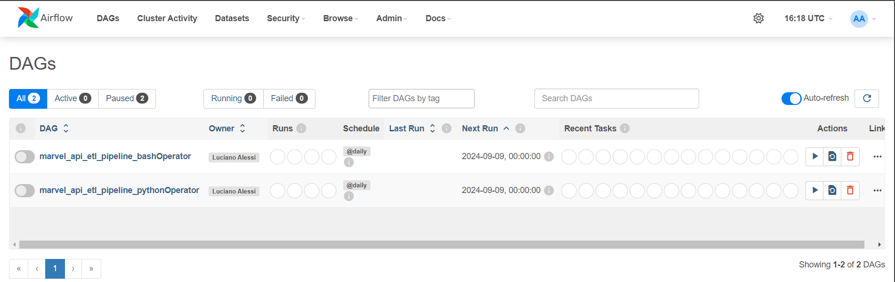

# Marvel ETL Data Pipeline with Airflow


This project implements an ETL (Extract, Transform, Load) pipeline to collect data from the Marvel API, transform it, and load it into an AWS Redshift database. The pipeline is orchestrated using Apache Airflow, which runs in Docker containers for easy deployment and management.

## Project Structure

- **DAGs**: The pipeline is defined using Directed Acyclic Graphs (DAGs) in Airflow, which control the workflow and task execution.
- **Python Scripts**: These scripts handle the extraction, transformation, and loading stages of the data from the Marvel API to AWS Redshift.
- **Docker**: The entire Airflow environment is encapsulated in Docker containers, making setup and portability easier.
- **AWS Redshift**: The transformed data is stored in a Redshift cluster, optimized for analysis and fast queries.

```plaintext
.
├── dags/
│   ├── marvel_etl_bashOperator_dag.py
│   ├── marvel_etl_pythonOperator_dag.py
│   └── utils_pythonOperator.py
├── datalake/
│   ├── bronze/
│   │   ├── characters/
│   │   │   ├── character_comics.parquet
│   │   │   └── characters.parquet
│   │   ├── comics/
│   │   │   └── comics.parquet
│   │   └── last_extraction_date.txt
│   └── silver/
│       ├── characters/
│       │   ├── character_comics.parquet
│       │   └── characters.parquet
│       └── comics/
│           └── comics.parquet
├── images/
├── scripts/
│   ├── api_test_connection.py
│   ├── extract.py
│   ├── transform.py
│   ├── load.py              
│   └── utils_bashOperator.py
├── .env
├── .gitignore
├── docker-compose.yaml
├── etl_local.ipynb
├── LICENSE
├── README.md
└── requirements.txt
```

### 1. `dags/`

Contains the DAGs used by Airflow to orchestrate the ETL pipeline:

- **`marvel_etl_bashOperator_dag.py`**: Defines the DAG using `BashOperators`, which execute ETL Python scripts via Bash commands.
- **`marvel_etl_pythonOperator_dag.py`**: Defines the DAG using `PythonOperators`, which directly execute Python code for extracting, transforming, and loading the data.
- **`utils_pythonOperator.py`**: Contains helper functions used in the DAG with `PythonOperator` to facilitate repetitive or common tasks.

### 2. `datalake/`

This directory simulates a **Data Lake** with different layers of data (bronze and silver) in **Parquet** format, organized by categories.

- **`bronze/`**: Stores raw data extracted from the Marvel API. This is the first data layer of the Data Lake.
  - **`characters/`**: Contains Parquet files of Marvel characters, including `character_comics.parquet`, which relates characters to comics.
  - **`comics/`**: Stores comic book information in Parquet format.
  - **`last_extraction_date.txt`**: Stores the last data extraction date, useful for incremental extractions.
  
- **`silver/`**: Stores the transformed and cleaned data, ready to be loaded into Redshift or used for analysis. This is the optimized layer of the Data Lake.
  - **`characters/`**: Contains already transformed character data.
  - **`comics/`**: Contains transformed comic data.

### 3. `scripts/`

Contains the Python scripts for the ETL phases:

- **`api_test_connection.py`**: Verifies connectivity to the Marvel API.
- **`extract.py`**: Extracts data from the API.
- **`transform.py`**: Cleans and transforms the extracted data, applying data optimization techniques.
- **`load.py`**: Loads the transformed data from the silver layer of the Data Lake to the AWS Redshift cluster for analysis and queries.
- **`utils_bashOperator.py`**: Defines required functions to perform the ETL.

### 4. `.env`

This file stores environment variables like API keys and AWS credentials.

### 5. `docker-compose.yaml`

Used by Docker Compose to configure the Airflow environment.

### 6. `etl_local.ipynb`

A Jupyter notebook that allows the ETL pipeline to be run locally, ideal for testing. It also documents in detail what is done in each stage of the process: **Extraction**, **Transformation**, and **Loading** to understand the functionality of each step.

## Prerequisites

- Docker and Docker Compose
- Python 3.x
- AWS CLI configured with credentials
- AWS Redshift cluster set up

## Setup and Installation

### 1. Clone the repository

```bash
git clone https://github.com/lucianoalessi/marvel-etl-data-pipeline-airflow
cd marvel-etl-project
```

### 2. Create and activate a virtual environment

It is recommended to use a virtual environment to avoid conflicts with other projects. Run the following commands:

- Create a virtual environment:

  ```bash
  python -m venv venv
  ```

- Activate the virtual environment:

  - On macOS/Linux:

    ```bash
    source venv/bin/activate
    ```

  - On Windows:

    ```bash
    venv\Scripts\activate
    ```

### 3. Install dependencies

Once the virtual environment is activated, install the dependencies from `requirements.txt`:

```bash
pip install -r requirements.txt
```

### 4. Configure the environment

Create a `.env` file in the project root with the following variables:

```env
AIRFLOW_UID=50000
MARVEL_PUBLIC_KEY=your_marvel_api_public_key
MARVEL_PRIVATE_KEY=your_marvel_api_private_key
REDSHIFT_HOST=your-redshift-cluster.amazonaws.com
REDSHIFT_PORT=5439
REDSHIFT_DB=your_database
REDSHIFT_USER=your_username
REDSHIFT_PASSWORD=your_password
```

### 5. Build and start the Docker containers

Run the following command:

```bash
docker-compose up -d --build
```
> **Note:** Make sure Docker is installed and running before executing the command.

### 6. Access the Airflow UI

Go to [http://localhost:8080](http://localhost:8080) and use the default credentials (`airflow`/`airflow`).

### 7. Initialize the database and run the DAG

In Airflow, enable and trigger the `marvel_etl_pipeline_pythonOperator` or `marvel_etl_pipeline_bashOperator` DAG.

### 8. Verify the data in Redshift

Check the loaded data in Redshift using any SQL client.

## DAG Overview

### DAG `marvel_etl_pipeline_bashOperator`

Orchestrates the following tasks:

1. **Test API connect**: Verifies the connection and authentication to the Marvel API using the `api_test_connect.py` script.
2. **Extract**: Extracts data from the Marvel API using the `extract.py` script and stores it in the Bronze layer of the Data Lake.
3. **Transform**: Cleans and transforms the data using the `transform.py` script, storing it in the Silver layer of the Data Lake.
4. **Load**: Loads the transformed data into AWS Redshift using the `load.py` script.

Note: These scripts use some functions located in the file: `utils_bashOperator.py`.

### DAG `marvel_etl_pipeline_pythonOperator`

Orchestrates the following tasks:

1. **Test API connect**: Verifies the connection to the Marvel API by executing the `test_api_connect()` function.
2. **Extract**: Extracts data from the API by executing the `extract()` function and saves it in the Bronze layer of the Data Lake.
3. **Transform**: Transforms and cleans the raw data by executing the `transform()` function and saving it in the Silver layer of the Data Lake.
4. **Load**: Loads the transformed data into Redshift by executing the `load()` function.

Note: Some functions are located in the file: `utils_pythonOperator.py`.



## License

This project is licensed under the MIT License. See [LICENSE](LICENSE) for more details.

## Contact

[Luciano Alessi](mailto:lucianoalessi9@gmail.com) |
[LinkedIn](https://www.linkedin.com/in/lucianoalessi/)
